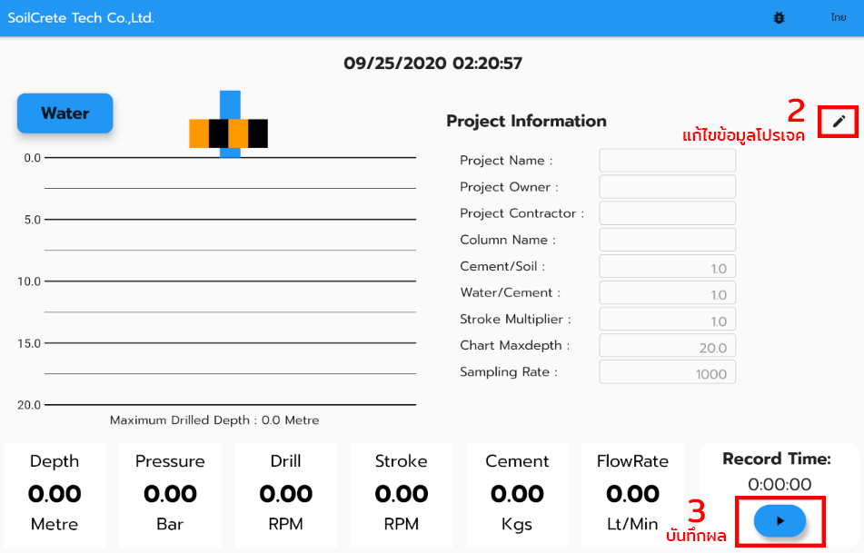
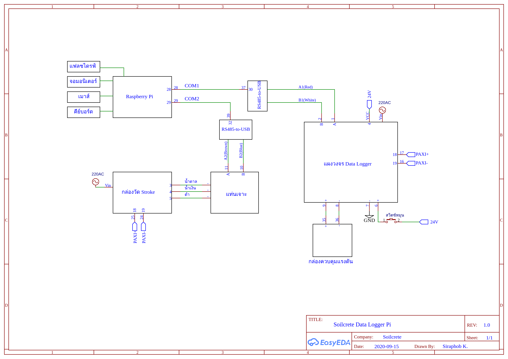
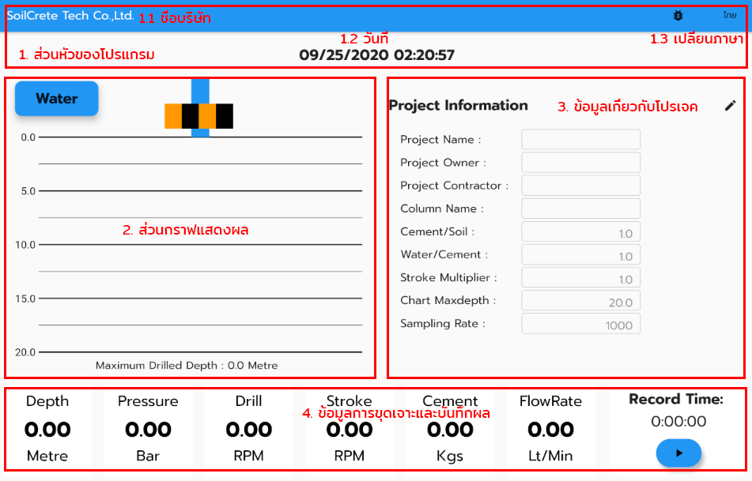
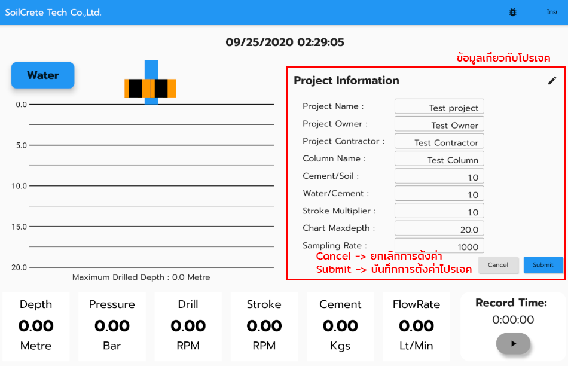
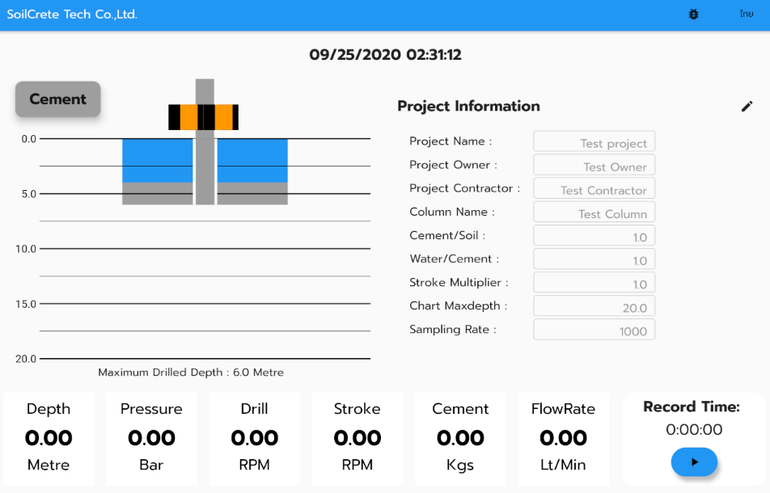
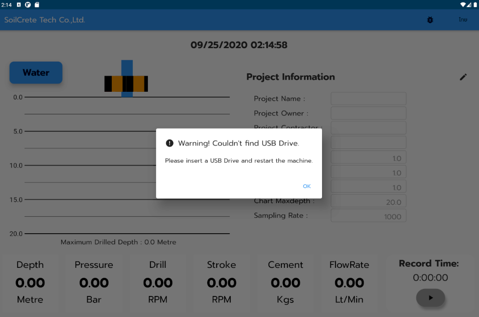
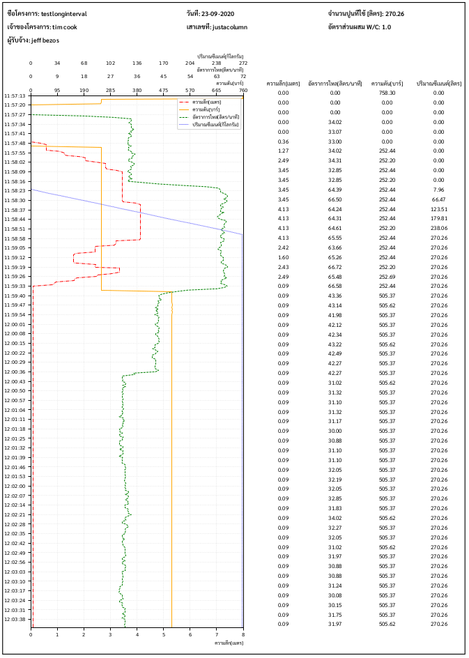

# Soilcrete Data Logger
โปรเจคสำหรับอ่านและบันทึกค่าการทำงานของเครื่องจักรเจาะดินและอัดเสาคอนกรีต

## **Revision History**
| Date          | Version       | Description    |
|:-------------:|:-------------:|:---------------|
| OCT 1ST, 2020 | 0.0.1         | Alpha Released |


## **สารบัญ**
---
- [Soilcrete Data Logger](#soilcrete-data-logger)
  - [**Revision History**](#revision-history)
  - [## **สารบัญ**](#h2-idสารบัญ-82สารบัญh2)
  - [## **Quickstart Guide**](#h2-idquickstart-guide-82quickstart-guideh2)
  - [## **การประกอบวงจร**](#h2-idการประกอบวงจร-82การประกอบวงจรh2)
    - [**รายการอุปกรณ์**](#รายการอุปกรณ์)
    - [**แผนภาพวงจร**](#แผนภาพวงจร)
    - [**ขั้นตอนการประกอบวงจร**](#ขั้นตอนการประกอบวงจร)
  - [## **การเปิดใช้งานอุปกรณ์**](#h2-idการเปิดใช้งานอุปกรณ์-82การเปิดใช้งานอุปกรณ์h2)
  - [## **การใช้งานโปรแกรมบนอุปกรณ์**](#h2-idการใช้งานโปรแกรมบนอุปกรณ์-82การใช้งานโปรแกรมบนอุปกรณ์h2)
    - [ส่วนประกอบของหน้าต่างการทำงาน](#ส่วนประกอบของหน้าต่างการทำงาน)
    - [การตั้งค่าโปรเจค](#การตั้งค่าโปรเจค)
    - [กราฟแสดงผลการขุดเจาะ](#กราฟแสดงผลการขุดเจาะ)
    - [การบันทึกข้อมูลลงแฟลชไดรฟ์](#การบันทึกข้อมูลลงแฟลชไดรฟ์)
  - [## **การสร้างไฟล์รายงานสำหรับโปรเจค**](#h2-idการสร้างไฟล์รายงานสำหรับโปรเจค-82การสร้างไฟล์รายงานสำหรับโปรเจคh2)
    - [ลงโปรแกรม python3 และ package ที่เกี่ยวข้อง](#ลงโปรแกรม-python3-และ-package-ที่เกี่ยวข้อง)
    - [การสร้างไฟล์รายงานด้วยโปรแกรม `generateReport.py`](#การสร้างไฟล์รายงานด้วยโปรแกรม-generatereportpy)

## **Quickstart Guide**
---
1. เมื่อต่อวงจรเรียบร้อย เสียบปลั๊กให้กับ Raspberry Pi โปรแกรมจะทำงานอัตโนมัติ

1. กดไอคอนรูปปากกาบริเวณขวาบนเพื่อแก้ไขข้อมูลโปรเจค เมื่อเสร็จเรียบร้อยแล้วกดปุ่ม submit
2. กดไอคอนเริ่มต้นการเก็บข้อมูลเพื่อเขียนข้อมูลลงแฟลชไดรฟ์
3. เมื่อบันทึกข้อมูลเสร็จเรียบร้อยแล้ว ถอดแฟลชไดรฟ์และนำไฟล์โปรเจกต์ไปใส่ไว้ในโฟลเดอร์ `records` ของโปรแกรม generateReport ในคอมพิวเตอร์อีกเครื่องหนึ่งแล้วรัน `generateReport.py` เพื่อสร้าง Report
## **การประกอบวงจร**
---
### **รายการอุปกรณ์**
- แท่นเจาะ
- กล่องเจ็ท
- หม้อแปลง 220VAC/24VDC
- บอร์ด Data Logger
- กล่องวัด Stroke
- ตัวแปลง RS485-to-USB
- Raspberry Pi 4 Model B (Ram 4GB)
- แฟลชไดรฟ์
- คีย์บอร์ดและเมาส์
- จอมอนิเตอร์

### **แผนภาพวงจร**



### **ขั้นตอนการประกอบวงจร**
1. เชื่อมต่อสาย Serial จากแท่นเจาะไปยัง Raspberry Pi ด้วยตัวแปลง RS485-to-USB
2. เชื่อมต่อสาย Serial จากแท่นเจาะไปยังกล่องวัด Stroke ด้วยสายสีน้ำตาล, สีน้ำเงิน และสีดำ ที่ช่องหมายเลข 3, 4 และ 5 ตามลำดับ
3. เชื่อมต่อสายไฟจากล่องวัด Stroke จากช่องหมายเลข 18(PAXI+) และ 19(PAXI-) ไปยังแผงวงจร Data Logger
4. เชื่อมต่อกล่องควบคุมแรงดันกับแผงวงจร Data Logger
5. เชื่อมต่อสวิตซ์หมุนกับแผงวงจร Data Logger ด้วยไฟเลี้ยง 24V
6. เชื่อมต่อสาย Serial จากช่อง A และ B ของ Data Logger ไปยัง Raspberry Pi ด้วยตัวแปลง RS485-to-USB
7. ติดตั้งจอมอนิเตอร์, เมาส์, คีย์บอร์ด และ USB กับ Raspberry Pi


## **การเปิดใช้งานอุปกรณ์**
---
หลังจากที่ต่อวงจรสมบูรณ์แล้ว เมื่อเปิดเครื่อง Raspberry Pi โปรแกรมจะทำงานอัตโนมัติ


## **การใช้งานโปรแกรมบนอุปกรณ์**
---
### ส่วนประกอบของหน้าต่างการทำงาน


หน้าต่างของโปรแกรมจะแบ่งออกเป็น 4 ส่วน คือ
1. **ส่วนหัวของโปรแกรม** แสดงข้อมูลส่วนต่างๆ ดังนี้
   - 1.1 ชื่อบริษัท
   - 1.2 วันที่และเวลา
   - 1.3 เปลี่ยนภาษา
2. **ส่วนของกราฟแสดงผล** แสดงข้อมูลเกี่ยวกับการขุดเจาะโดยกราฟจะแสดงสีฟ้าเมื่อใช้น้ำและจะแสดงสีเทาเมื่อใช้คอนกรีต โดยจะมีข้อความแสดงว่ากำลังใช้น้ำหรือคอนกรีตอยู่ (Water/Cement)
3. **ส่วนข้อมูลเกี่ยวกับโปรเจค** แสดงข้อมูลเกี่ยวกับโปรเจค เช่น ชื่อโปรเจค, เจ้าของโปรเจค, ผู้รับจ้าง, อื่นๆ โดยจะสามารถแก้ไขข้อมูลเหล่านี้ได้โดยกดปุ่มรูปปากกาบริเวณขวาบน ข้อมูลเหล่านี้จะถูกบันทึกเมื่อกดปุ่มบันทึกข้อมูลการขุดเจาะ
4. **ส่วนข้อมูลเกี่ยวกับการขุดเจาะและการบันทึกผล** แสดงข้อมูลเกี่ยวกับการขุดเจาะ ณ เวลานั้น ๆ โดยบริเวณขวาล่างจะมีกล่องสำหรับกดบันทึกผลโดยผู้ใช้สามารถเลือกที่จะบันทึกผลลงไฟล์ได้เมื่อกดปุ่มบันทึก


### การตั้งค่าโปรเจค


เมื่อต้องการตั้งค่าโปรเจค ให้กดไอคอนรูปปากกาที่อยู่บริเวณขวาบนของส่วนข้อมูลเกี่ยวกับโปรเจค เมื่อกดแล้วกล่องข้อความจะสามารถแก้ไขข้อมูลได้ เมื่อใส่ข้อมูลเสร็จเรียบร้อยแล้วให้กด submit เพื่อบันทึกค่า หรือกด cancel เพื่อยกเลิกการใส่ข้อมูล


### กราฟแสดงผลการขุดเจาะ


เมื่อเริ่มการขุดเจาะจะสังเกตได้ว่ากราฟทางด้านซ้ายจะแสดงผลการขุดเจาะแปรผันตามความลึกและแรงดันที่ใช้ในการขุดเจาะ

### การบันทึกข้อมูลลงแฟลชไดรฟ์


เมื่อเริ่มการทำงานโปรแกรมจะค้นหาแฟลชไดรฟ์ที่ติดตั้งอยู่กับ Raspberry Pi หากโปรแกรมหาแฟลชไดรฟ์ไม่พบจะขึ้นหน้าต่างแจ้งเตือนในกรณีนี้ให้ผู้ใช้ติดตั้งแฟลชไดรฟ์ หลังจากนั้นให้ปิดและเปิดอุปกรณ์ใหม่อีกครั้ง

หลังจากที่ตั้งค่าโปรเจคเสร็จเรียบร้อยแล้ว บริเวณกล่องบันทึกข้อมูลให้กดปุ่มบันทึกเพื่อเริ่มบันทึกผล โดยโปรแกรมจะเริ่มบันทึกลงในไฟล์ .csv ไปยังแฟลชไดรฟ์ เมื่อบันทึกผลเสร็จแล้วสามารถกดปุ่มหยุดเพื่อหยุดบันทึกผล

เมื่อบันทึกผลเสร็จเรียบร้อยแล้วไฟล์ในแฟลชไดรฟ์จะถูกบันทึกอยู่ในโฟลเดอร์ที่มีชื่อโปรเจคและภายในโปรเจคจะมีชื่อไฟล์ของแต่ละเสาอยู่โดยไฟล์ดังกล่าวจะอยู่ในฟอร์แมต .csv ไฟล์เสาแต่ละเสาจะตามด้วยวันที่เพื่อบ่งบอกว่าาเสานั้นจัดทำขึ้นเมื่อวันที่เท่าใด โครงสร้างของโฟลเดอร์มีลักษณะดังนี้
```
Flashdrive
    |
    |----- ProjectA/
    |         |------ Column1_20200811.csv
    |         '------ Column2_20200812.csv
    |
    |----- ProjectB/
    |         |------ ColumnA_20200930.csv
    |         '------ ColumnB_20200930.csv
    |
    |----- ProjectN/
              |------ ColumnX_YYYYMMDD.csv
              |------ ...
              .
              .
```
  

## **การสร้างไฟล์รายงานสำหรับโปรเจค**
---
### ลงโปรแกรม python3 และ package ที่เกี่ยวข้อง
ขั้นตอนการสร้างไฟล์รายงานจะต้องใช้โปรแกรม python3 สามารถติดตั้งได้โดยทำตามขั้นตอนต่อไปนี้
1. ดาวน์โหลดโปรแกรม python โดยไปที่เว็บไซต์ https://www.python.org/ หรือคลิก [ที่นี่](https://www.python.org/ftp/python/3.8.6/python-3.8.6.exe)
>**คำเตือน**: Python 3.8.6 ไม่สามารถใช้งานกับ WindowsXP หรือ Windows รุ่นที่ตำกว่านั้นได้
2. เมื่อเข้ามาในเว็บไซต์แล้ว คลิกที่แท็บ Downloads แล้วเลือกแพลตฟอร์มที่ต้องการติดตั้ง เช่น Windows, Linux โดยให้ติดตั้ง Python version 3.8.0 ขึ้นไป
3. ดับเบิ้ลคลิกเพื่อ install และติ๊ก `Add Python to PATH`
4. เสร็จสิ้นการติดตั้ง เปิด Command Prompt หรือ Powershell เพื่อเข้าสู้หน้าต่าง terminal
5. รันคำสั่งดังต่อไปนี้ทีละคำสั่งเพื่อติดตั้ง package ที่จำเป็น

```shell
C:\your\system\path> pip install 'matplotlib==3.3.2'
```

```shell
C:\your\system\path> pip install 'pandas==1.1.2'
```

```shell
C:\your\system\path> pip install 'numpy==1.19.2'
```

### การสร้างไฟล์รายงานด้วยโปรแกรม `generateReport.py`
1. ดาวน์โหลดโปรแกรม `generateReport.py` โดยคลิก[ที่นี่](https://drive.google.com/file/d/12LRt1O8ZkWYGptnYguyswL_lLNYBtQ8p/view?usp=sharing)
2. Extract ไฟล์ .zip ออกมาจะพบว่ามีไฟล์ `generateReport.py` และโฟลเดอร์ `records` อยู่ 
```
generateReport
      |---------- generateReport.py
      '---------- records/
```
3. Copy โฟลเดอร์โปรเจกต์ที่มีการบันทึกจากแฟลชไดรฟ์มา Paste ไว้ในโฟลเดอร์ `records` 
```
generateReport
      |---------- generateReport.py
      '---------- records/
                    |-------- ProjectA/
                    |             |--------- column1_YYYYMMDD.csv
                    |             '--------- column2_YYYYMMDD.csv
                    '-------- ProjectB/
                                  '--------- columnA_YYYYMMDD.csv

```
4. หลังจากนั้น เปิดหน้าต่าง Command Prompt และเปลี่ยนไดเรกทอรี (คำสั่ง cd) ไปยังโฟลเดอร์ `generateReport` แล้วรันคำสั่งดังนี้
```
C:\your\system\path\generateReport > python generateReport.py
```
5. โปรแกรมจะค้นหาไฟล์โปรเจคและเสาทั้งหมดในโฟลเดอร์ `records` และสร้าง report ของไฟล์นั้นขึ้นมา หากไฟล์ report นั้นมีอยู่แล้วโปรแกรมจะไม่สร้างไฟล์ขึ้นมาใหม่ หากต้องการสร้างใหม่ ให้ลบไฟล์report เก่าทิ้งไปก่อนแล้วจึงรันสคริปอีกครั้ง

> คำแนะนำ: สามารถใส่ flag `-v` ในคำสั่งสร้างไฟล์รายงานได้เพื่อปริ้นท์การทำงานของโปรแกรมโดยละเอียด
> ```
> C:\your\system\path\generateReport > python generateReport.py -v
> ```
6. เมื่อรันคำสั่งสมบูรณ์แล้วไฟล์ที่ได้จะอยู่ในรูปแบบของ pdf ในโฟลเดอร์โปรเจคนั้นๆ
```
generateReport
      |---------- generateReport.py
      '---------- records/
                    |-------- ProjectA/
                    |             |--------- column1_YYYYMMDD.csv
                    |             |--------- column1_YYYYMMDD.pdf
                    |             |--------- column2_YYYYMMDD.csv
                    |             '--------- column2_YYYYMMDD.pdf
                    '-------- ProjectB/
                                  |--------- columnA_YYYYMMDD.csv
                                  '--------- columnA_YYYYMMDD.pdf

```
7. ตัวอย่างการทำงานของโปรแกรม `generateReport.py`
- เมื่อสร้างไฟล์รายงาน
```
C:\your\system\path\generateReport > python generateReport.py -v
Generating column1_20200102.csv
Generating column2_20200203.csv
Generating column3_20200304.csv
```
- เมื่อรันคำสั่งที่มีไฟล์รายงานอยู่แล้ว
```
C:\your\system\path\generateReport > python generateReport.py -v
C:\your\system\path\records\projectA\column1_20200102.csv already generated.
C:\your\system\path\records\projectA\column2_20200203.csv already generated.
C:\your\system\path\records\projectA\column3_20200304.csv already generated.
```
8. ตัวอย่างไฟล์รายงาน



# soilcrete-data-logger-test
